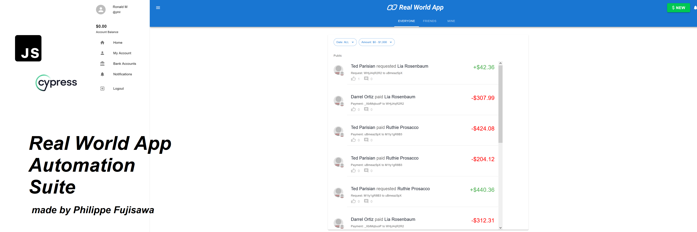

# Cypress RealWorld App


_This repository from (https://github.com/cypress-io/cypress-realworld-app) contains my individual Cypress end-to-end tests for the RealWorld application, focusing on Sign In, Sign Up, Send Money and Transaction History functionalities._

**Para README em Português acessar no repositório o documento README-PTBR.md**

**This Cypress automation will cover:**

+ signup.spec.js: Tests user registration and validations.
+ signin.spec.js: Verifies login functionality.
+ sendMoney.spec.js: User send money and check transation confirmation.
+ history.spec.js: User check transaction history.
+ **Bug Report** about balance issue at report paste `reports => bug_001.md`

### Prerequisites

This project requires [Node.js](https://nodejs.org/en/) to be installed on your machine. Refer to the [.node-version](./.node-version) file for the exact version.

[Yarn Classic](https://classic.yarnpkg.com/) is also required. Once you have [Node.js](https://nodejs.org/en/) installed, execute the following to install the npm module [yarn](https://www.npmjs.com/package/yarn) (Classic - version 1) globally.

```
npm install yarn@latest -g
```

If you have Node.js' experimental [Corepack](https://nodejs.org/dist/latest/docs/api/corepack.html) feature enabled, then you should skip the step `npm install yarn@latest -g` to install Yarn Classic globally. The RWA project is locally configured for `Corepack` to use Yarn Classic (version 1).

#### Yarn Modern

**This project is not compatible with [Yarn Modern](https://yarnpkg.com/) (version 2 and later).**

### Installation

To clone the repo to your local system and install dependencies, execute the following commands:

```
git clone https://github.com/philfujisawa/cypress-realworld-app.git
cd cypress-realworld-app
yarn
npm install chance
```
### Run the app

```
yarn dev
```

### Start Cypress

```
yarn cypress:open
```

THANK YOU SO MUCH!