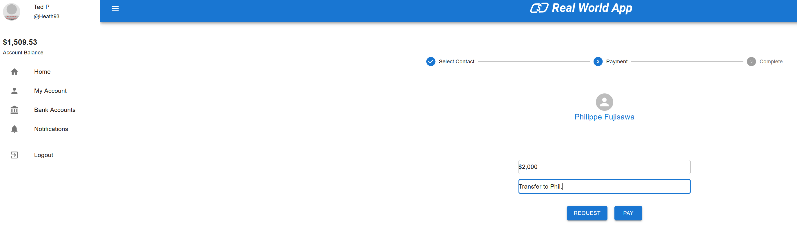
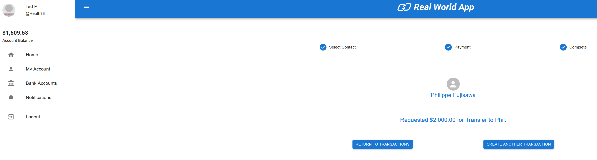
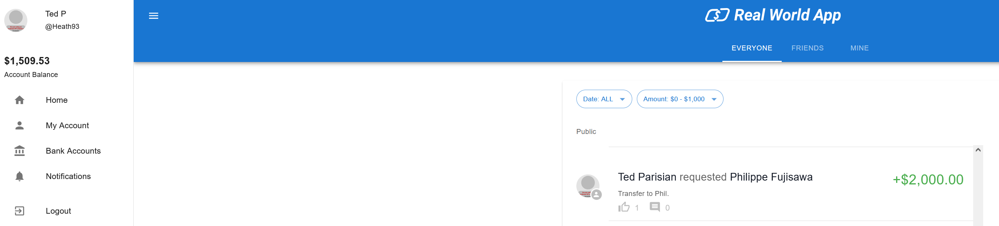
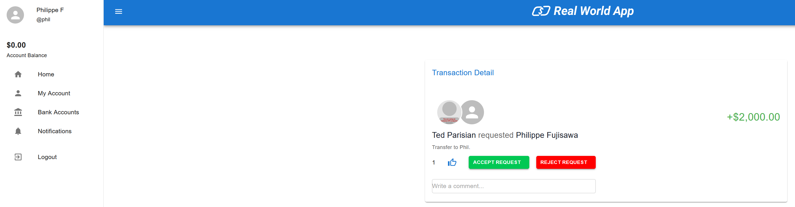
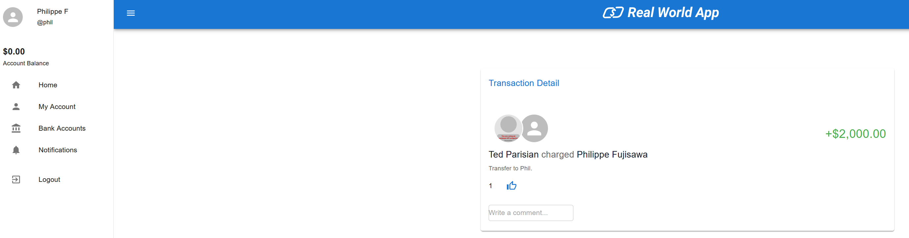
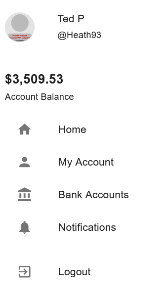

# Bug Report: [REP-001 - Transaction Without Balance]

## **Identifier**
- Bug ID: 001
- Data: 24/11/2024  
- Reported by: Philippe Fujisawa

---

## **bug Description**
- **Expected behavior**: The system should block any transaction if the account does not have sufficient balance.
- **Observed behavior**: The system allows money transfers even when the account balance is zero or negative.

---

## **Severity**
- **Critical**: This issue directly impacts the core functionality of the system and may lead to financial losses, user trust erosion, and potential legal problems.  
## **Priority**
- **High**: This issue needs URGENT fix.

---

## **Steps to Reproduce**
1. Log in to the application using valid credentials.
2. Ensure the account balance is $0.00.
3. Attempt to transfer an amount greater than the current balance.
4. Observe that the transaction completes successfully.

---

## **Impact**
- Incorrect account balances.
- Potential financial issues and trust loss for users.
- Regulatory compliance risks for the application.

---

## **Environment**
- **SO**: Windows 10
- **Browser**: Chrome
- **Hardware**: AMD ryzen 5, 16GB RAM.

---

## **Attachments**
- Screenshot showing the transaction confirmation despite insufficient balance.

+ Step 1: Request transfer of $2000 ("Ted" Account).

+ Step 2: Confirmation of tranfer request.

+ Step 3: Request history registration.

+ Step 4: Screen to accept with $0 Balance to tranfer money to "Ted" ("Phil" Account).

+ Step 5: Accept and confirmation of transation request, look that Balance is still $0 and system accept this transaction.

+ Step 6: Confirmation of transfer to "Ted" that have +$2000. Confirm the bug issue.

---

## **Solutions Tried**
- Retested with different accounts, but the issue persists.